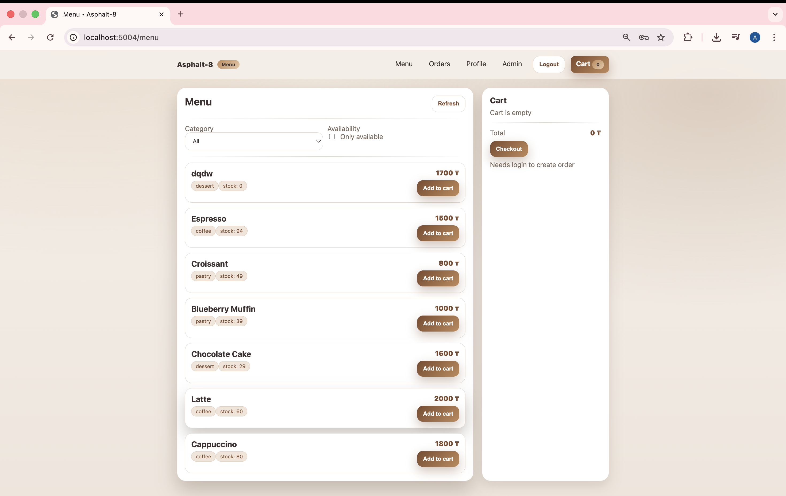
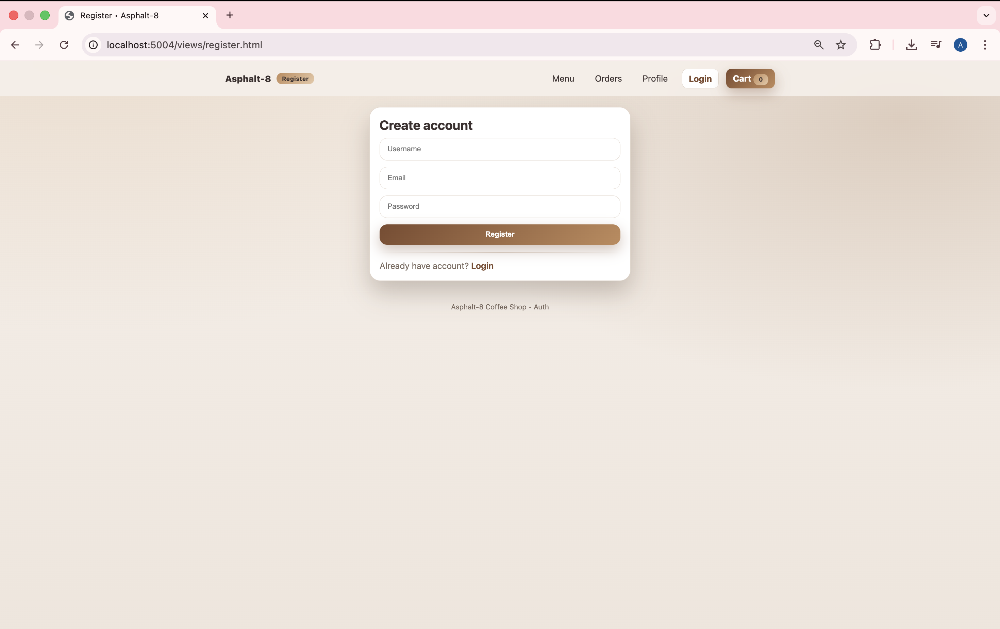
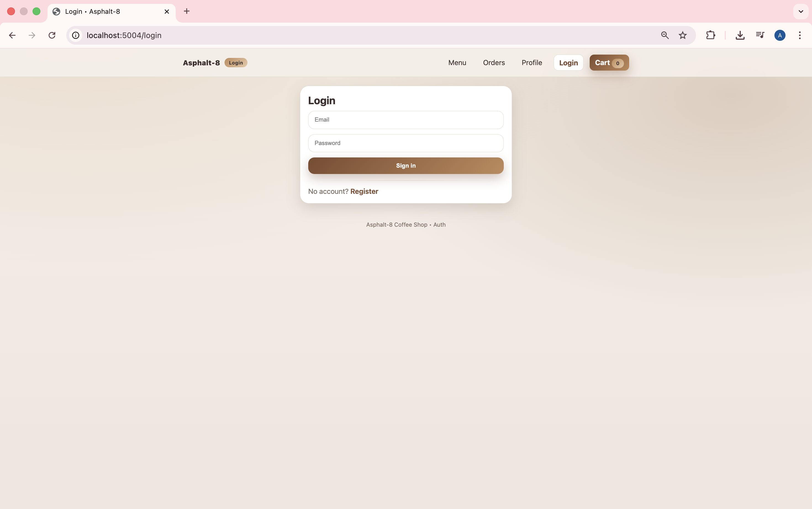
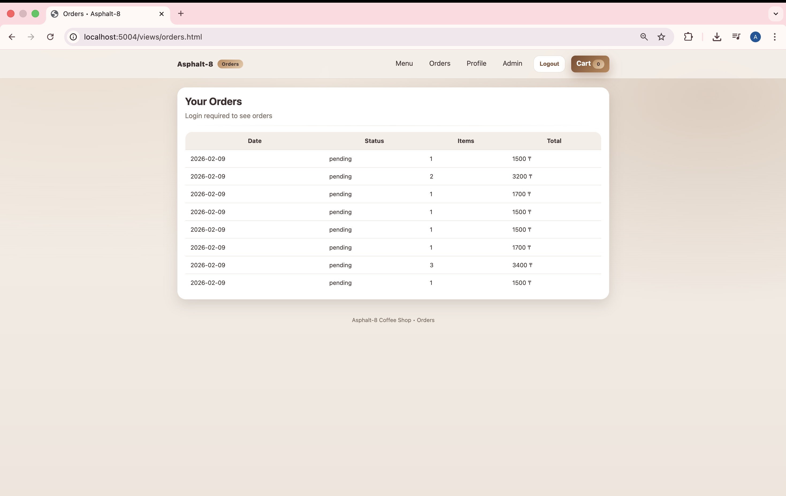
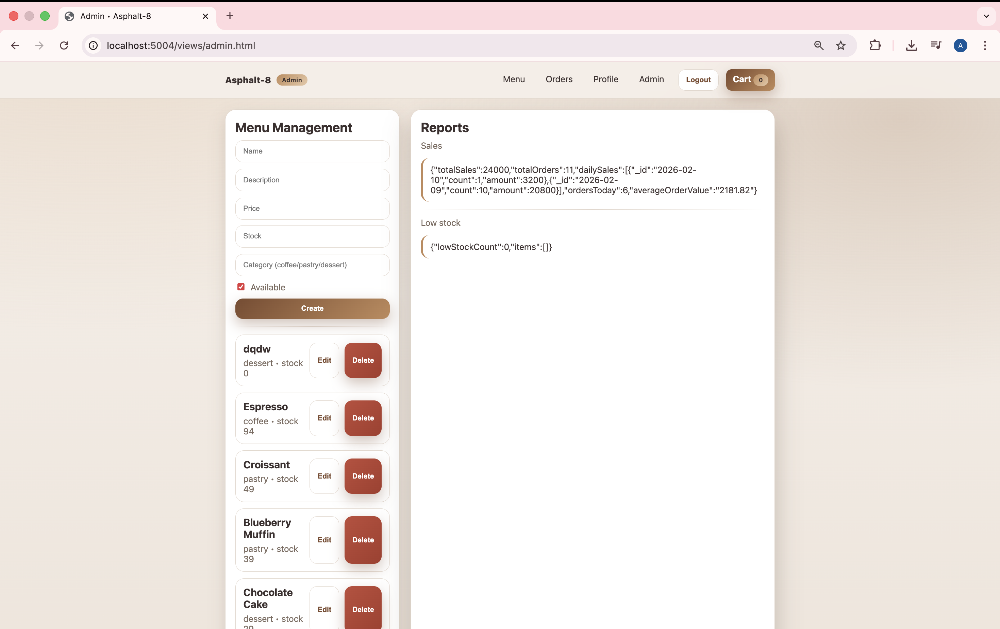

# ☕ Asphalt-8 Coffee Shop Website

Course: Web Technologies 2

Group: SE-2416

Team: Askhat Rakhmetollayev, Aldiyar Gaisa , Merey Amangeldi

## 📌 Project Overview
Coffee Shop Management System is a full-stack web application built with Node.js, Express, and MongoDB Atlas.  
The application allows users to register, log in, browse the menu, place orders, and manage their profiles.  
It also includes role-based access control with an admin panel for managing menu items, orders, and reports.

This project demonstrates secure authentication, RESTful API design, database integration, validation, and deployment-ready architecture.

## 🧩 Team Responsibilities:
Askhat: Backend APIs (Express routes/controllers), project setup/proposal.

Aldiyar: Frontend (HTML/CSS/JS pages, API integration).

Merey: Database (MongoDB schemas), auth middleware.

---

## ⚙️ Technologies Used
- Node.js
- Express.js
- MongoDB Atlas
- Mongoose
- JSON Web Token (JWT)
- bcrypt
- Nodemailer
- HTML, CSS, JavaScript
- dotenv

---

## 📂 Project Structure

project-root/
├── config/│ 
│   └── database.js
│
├── controllers/
│   ├── authController.js
│   ├── userController.js
│   ├── menuController.js
│   ├── orderController.js
│   └── reportController.js
│
├── middleware/
│   ├── authHandler.js
│   ├── errorHandler.js
│   └── validation.js
│
├── models/
│   ├── User.js
│   ├── MenuItem.js
│   └── Order.js
│
├── routes/
│   ├── authRoutes.js
│   ├── users.js
│   ├── menuRoutes.js
│   ├── orders.js
│   └── reports.js
│
├── public/
│   ├── css/
│   │   └── style.css
│   │
│   ├── js/
│   │   ├── api.js
│   │   ├── auth.js
│   │   ├── cart.js
│   │   ├── profile.js
│   │   └── menu.js
│   │
│   └── views/
│       ├── index.html
│       ├── login.html
│       ├── register.html
│       ├── menu.html
│       ├── profile.html
│       ├── orders.html
│       └── admin.html
│
├── server.js
├── seed.js
├── package.json
├── package-lock.json
├── .env
└── README.md

---

## 🗄️ Database
The project uses MongoDB Atlas as a cloud database.

### Collections:
**User**
- username
- email
- password (hashed)
- role (user / admin)

**MenuItem**
- name
- description
- price

**Order**
- user
- items
- totalPrice
- status
- createdAt

The database connection URI is stored securely in environment variables.

---

## 🔐 Authentication & Security
- Password hashing using bcrypt
- JWT-based authentication
- Protected routes using authentication middleware
- Sensitive data stored in environment variables

---

## 🚀 API Endpoints

### Authentication (Public)
- POST `/api/auth/register` – Register a new user
- POST `/api/auth/login` – Login and receive JWT

### User Management (Private)
- GET `/api/users/profile` – Retrieve user profile
- PUT `/api/users/profile` – Update user profile

### Menu & Orders (Private)
- POST `/api/menu` – Create menu item (admin only)
- GET `/api/menu` – Get all menu items
- PUT `/api/menu/:id` – Update menu item (admin only)
- DELETE `/api/menu/:id` – Delete menu item (admin only)

- POST `/api/orders` – Create order
- GET `/api/orders` – Retrieve user orders
- GET `/api/orders/:id` – Retrieve order by ID
- PUT `/api/orders/:id` – Update order status
- DELETE `/api/orders/:id` – Delete order

---

## ✅ Validation & Error Handling
- Input validation using custom middleware
- Proper HTTP status codes:
    - 400 – Bad Request
    - 401 – Unauthorized
    - 404 – Not Found
    - 500 – Internal Server Error
- Global error-handling middleware implemented

---

## 🖼️ Screenshots (Web App Features)

### Home Page

Main landing page of the application.

### User Registration

User registration form with input validation.

### User Login

Login page with JWT authentication.

### Menu Page

Menu displaying available items.

### Orders Page

User order history and order management.

### Admin Panel

Admin dashboard for managing menu items and orders.

---

## 🧪 Setup Instructions
1. Clone the repository
2. Install dependencies:
3. Create .env file using .env.example	
4. Run the project:

🌍 Deployment

The project is deployed on a cloud platform (Render / Railway / Replit).

Live URL:
(https://dashboard.render.com/web/srv-d654d9ngi27c73ervp60/deploys/dep-d654d9vgi27c73ervpbg)

👥 Team Work & Defence
•	The project was developed as a group project
•	All team members contributed to backend and frontend development

🏁 Conclusion

This project demonstrates a complete web application with secure authentication, cloud database integration, RESTful API design, and a functional user interface.
It follows modular architecture principles and is ready for deployment.
